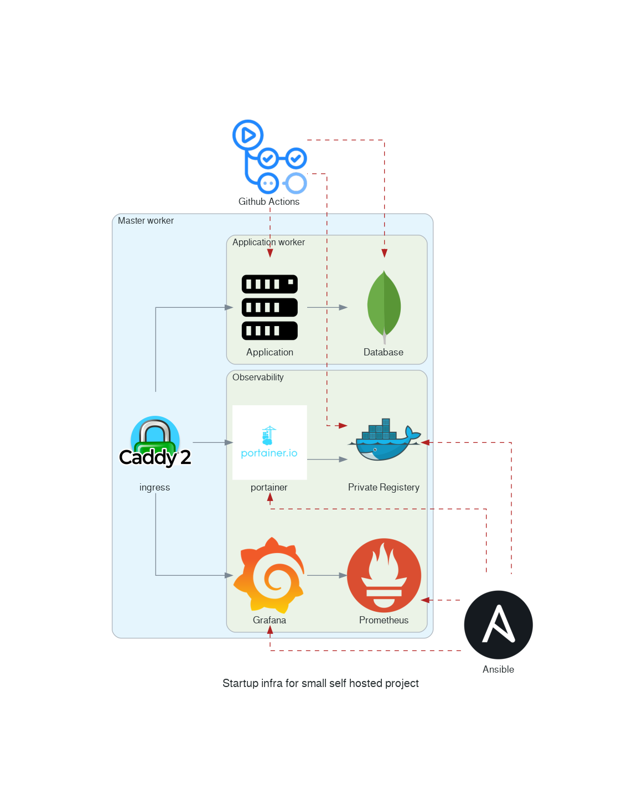
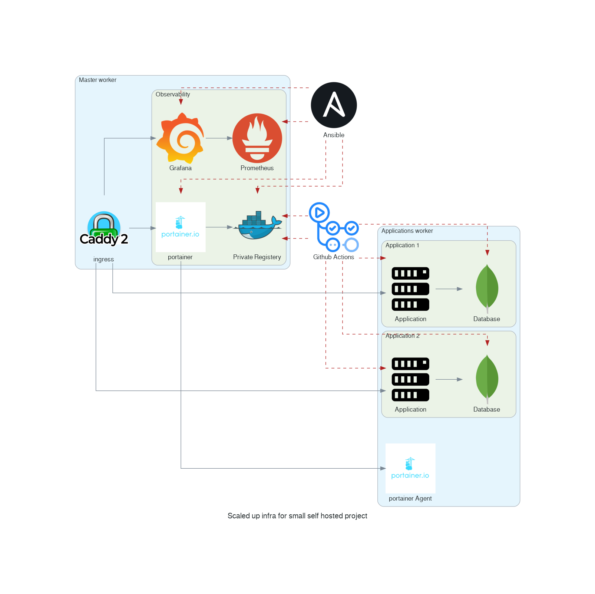

# Startup infra for small self-hosted project

This repository provide ansible playbook to setup a minimal infrastructure for a simple self-hosted application. Ideal for small hobby projects.

Features:
* docker-swarm
* Caddy
    * [Auth Portal](https://github.com/greenpau/caddy-auth-portal)
    * [Docker Proxy](https://github.com/lucaslorentz/caddy-docker-proxy)
* Private docker registery
* Portainer
* Prometheus 
* Graphana

## Articles and Tutorials

The article / tutorial are splited into two section. The first teaches you the tools I use to complete this project. The second give you introduction to the application I selected to help me manage this project and how to deploy them using the 

### Learn the tools

* [ ] 🧰 1: [Design and Test Ansible playbook with Vagrant](https://faun.pub/a-disposable-local-test-environment-is-essential-for-devops-sysadmin-af97fa8f3db0?sk=f2f0e3a6b4fe4215cec13019887b6302)
* [ ] WIP: 🧰 2: [Automate Infrastructure provisionning with Ansible and Github action]()

### Learn about the applications used in this setup

* [ ] WIP: ☸️ 1: [What is Portainer and why you might need it.]()
* [ ] WIP: ☸️ 2: [What is Prometheus and why you might need it.]()
* [ ] WIP: ☸️ 3: [What is Caddy and why you might need it.]()

## Architecture



## Setup host

Setup machine after recieving it.

### 1. Add ssh key

```
ansible-playbook 0_setup_host/password-less-ssh/playbook.yml
```

### 2. Install docker

```
ansible-playbook -i inventory/ 0_setup_host/install-docker/playbook.yml
```

### 3. Init docker swarm

```
ansible-playbook -i inventory/ 0_setup_host/init-docker-swarm/playbook.yml
```

## Setup Security

### 1. Caddy reverse proxy

```
ansible-playbook -i inventory/ 1_deploy-caddy/playbook.yml
```

Now you can protect your container behind the caddy auth portal by adding labels in your deployment

```
labels:
    # Add the link of the container to the auth portal
    caddy_0: (ui_links)
    caddy_0.Whoami1: /whoami1
    # Add a route to your container
    ## Domain for your container
    caddy_1: nokwebspace.ovh
    ## Route to access your container
    caddy_1.route: /whoami1*
    ## A snippet is create do add all you need for the route
    caddy_1.route.import: service_route_snippet whoami1
    ## Define who can access that container
    caddy_1.route.jwt.allow: roles user admin superadmin
    ## Define the reverse proxy to point to your container
    caddy_1.route.reverse_proxy: "{{upstreams 80}}"
```

## Setup Tools

### 1. Docker Registry

Download the caddy client locally and hash you docker-registry password. Then add it to `vars.env.yml` as the value for `REGISTRY_PASSWORD`

```
caddy hash-password
```

```
ansible-playbook -i inventory/ 2_deploy-registry/playbook.yml
```

### 2. Portainer

```
ansible-playbook -i inventory/ 3_deploy-portainer/playbook.yml
```

## Alias

Use common infrastructure tools in docker with:
* [docker_tools_alias.sh](./bin/docker_tools_alias.sh)

```
source ./bin/docker_tools_alias.sh
```

```
use dasb for ansible in docker
use dap for ansible-playbook in docker
use daws for awscli in docker
use dpk for packer in docker
use dtf for terraform in docker
use dbash for bash in docker
```

## Scale Up

With docker swarm and portainer it because easy to manager multiple nodes.

